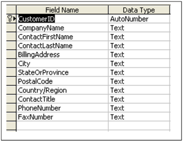
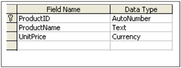
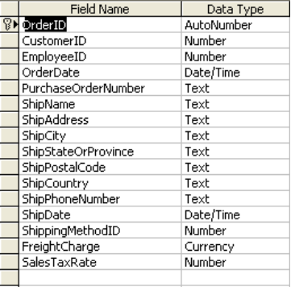
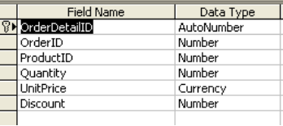



**LIMERICK INSTITUTE OF TECHNOLOGY ****

**WINTER** **EXAMINATIONS** **2019/2020**

COMP06043 – Databases for Project 

Winter Examinations 2019/2020   Page 1 of 12 

**MODULE:**  

**PROGRAMME(S):**  LC\_KISYM\_KMY 

LC\_KISYM\_JMY LC\_KISYM\_IMY 

**YEAR OF STUDY:  EXAMINER(S):** 

**TIME ALLOWED:  INSTRUCTIONS:**  

COMP06043-Databases for Project 

Bachelor of Science (Honours) Internet Systems Development 

Bachelor of Science Internet Systems Development Higher Certificate in Science Internet Systems Development 

2 

Dr. Carol Rainsford  (Internal) Dr. Stephen Sheridan  (External) 

**2 HOURS** 

**Answer Question 1 (mandatory) and** 

**answer any 2 other questions.**  

**Question 1 is 40 marks all other questions are 30 marks.** 

COMP06043 – Databases for Project 

Winter Examinations 2019/2020   Page 4 of 4 

**PLEASE DO NOT TURN OVER THIS PAGE UNTIL YOU ARE INSTRUCTED TO DO SO. **The use of programmable or text storing calculators is expressly forbidden.

Please note that where a candidate answers more than the required number of questions, the examiner will mark all questions attempted and then select the highest scoring ones.

***There are no additional requirements for this paper.***

***QUESTION 1  [TOTAL MARKS: 40]*** 

Computer  Components  Inc.  is  a  retailer  of  computer  products.  All  information regarding customers and sales are stored in a relational database. The company database has 4 main tables. The names of these tables and a description of each table are as follows: 

|**Table Name** |**Description** |
| - | - |
|customers |This table stores all customer information such as contact information |
|products |This table contains information regarding products sold by Computer Components Inc. |
|orders |The orders table contains information of orders made by customers. A customer can purchase multiple products on one order.  |
|orderDetail |The order detail table contains the details of a specific order made by a customer, for example the quantity of the product purchased etc. |

The structure of the relations as well as the data types for each field is available in **Appendix** **A** of this document. Using the structure and data types for each attribute outlined in Appendix A perform the following: 

**Q 1(a)  [7 Marks]** 

Computer Components Inc. wish to produce a list of all customers in the state of ‘CA’. The list should contain the following information 

- CustomerID,  
- BillingAddress,  
- StateORProvince  
- PhoneNumber.   

**Write** an SQL query that will produce this list and **sort** the list by billing address.  

**Q 1(b)  [5 Marks]** 

Computer Components Inc. have launched a new product called External Driver 1000. The external drive costs €650.00. **Write** an SQL query which will add this new product to the products table. 

**Q 1(c)  [8 Marks]** 

Computer Components Inc. require you to produce a report that contains the following information: 

- OrderID 
- ProductID 
- TotalCost  

The TotalCost = Quantity \* UnitPrice – Discount 

Write a query that will retrieve the above information for the report.   

**Q 1(d)  [10 Marks]** Computer  Components  Inc.  requires  you  to  produce  a  report  that  contains  the 

following information: 

- CustomerID 
- PurchaseOrderNumber 
- ShipPhoneNumber 
- ShipDate 

The report should contain only the above information for orders where the ShipCountry is either England, Ireland Scotland or France. 

**Write** two versions of the above query.  

**Q 1(e)  [10 Marks]** 

Using the OrderDetails table Computer Components Inc. requires you to produce a report that will calculate per product the total revenue generated before discounts for each product sold. The total revenue  (TotalRevenue)  generated is calculated by (UnitPrice \* Quantity). The report should contains the following information: 

- ProductId 
- TotalRevenue. 

***[End of Question 1]*** 

COMP06043 – Databases for Project 

Winter Examinations 2019/2020   Page 4 of 12 
***QUESTION 6  [TOTAL MARKS: 30]*** 

**Q 2(a)  [14 Marks]** 

**Define** what is meant by the following and provide **examples** to illustrate your  definition: 

1) Relation 
1) Tuple 
1) Degree 
1) Cardinality 

**Q 2(b)  [7 Marks] Outline** the properties of a relation. 

**Q 2(c)  [9 Marks] Define** three (3) different meanings of the presence of a NULL value in an attribute of a relation.  

***[End of Question 2]*** 

The relation found in Table 1 contains information in un-Normalised form. It is a snapshot of dentist/patient appointment data. A patient is given an appointment at a specific time and date with a dentist located at a particular surgery. On each day of patient appointments, a dentist is allocated to a specific surgery for that day. Dentists see only one patient at a time.  

**Examine** the Relation below and answer the questions that follow:  

Normalise the Relation found above using 1st, 2nd and 3rd normal form rules.   

**Q 3(a)  [18 Marks]** Clearly illustrate the Relations(s) and data in 1st, 2nd and 3rd normal form.  

**Q 3(b)  [7 Marks]** Identify the primary key attribute(s) at each stage of normalization. 

**Q 3(c)  [5 Marks]** Identify potential names for new tables. Names should reflect the content in each table. 

COMP06043 – Databases for Project 

Winter Examinations 2019/2020   Page 6 of 12 

|**surgeryNo** |**App\_date** |**App\_time** |**dentistNo** |**surgeryAddress** |**dentistName** |**patNo** |**patName** |
| - | - | - | - | - | - | - | - |
|15 |12-09-08 |10:00 |S1011 |Raheen, Limerick |Tony Smith |P100 |Gillian White |
|15 |12-09-08 |12:00 ||Raheen, Limerick ||P105 |Gillian White |
|10 |12-09-08 |10:00 |S1024 |Ennis Rd, Limerick |Helen Peterson |P108 |Ian MacKay |
|10 |14-09-08 |14:00 ||Ennis Rd, Limerick ||P108 |Ian MacKay |
|15 |14-09-08 |16:30 |S1032 |Raheen, Limerick |Robert Plevin |P105 |Jill Bell |
|13 |15-09-08 |18:30 ||City Centre, Limerick ||P110 |John Walker |

**Table 1 – Dentist Patient Appointments Relation *[End of Question 3]*** 

COMP06043 – Databases for Project 

Winter Examinations 2019/2020   Page 7 of 11 

***QUESTION 4  [TOTAL MARKS: 30]*** 

Read the Case Study carefully and answer the following questions. Murray’s travel agent has hired you to design their database for them. They have provided you with the following information to help you in designing the database system. Murray’s travel agent has a number of branches around Ireland. The data held on each branch is the branch address made up of street, city, state and zip code and the telephone number. Each branch is given a branch number, which is unique. Each branch is allocated staff. A manager can manage a number of branches. The data held on each member of staff is his or her name, their unique PPS number, their position (sales rep or manager) and salary. Each member of staff has a unique staff number. A staff member can manage a number of customer accounts. The data held on each customer is customer name, customer address, contact number and sales rep (the person who manages their account). Each customer has a unique customer code. Data is stored regarding all the bookings a customer has made with the company. The data held about a booking is booking date, the customer number the booking was made for, the price and destination. Each booking is given a unique booking code.  A customer can make many bookings. Depending on if a customer has made a previous booking a special discount is applied to the cost of a customer's trip. A customer with at least one previous booking will receive a booking discount. The data stored on discounts is a unique discount id, the customer id and the amount of discount. 

**Q 4(a)  [5 Marks]** Clearly identify the entities described in the above Case Study. 

**Q 4(b)  [10 Marks]** Identify potential attributes associated with each entity identified. 

**Q 4(c)  [15 Marks]** 

Draw an Entity Relationship Diagram to represent the above case study. Remove many to many relationships. 

***[End of Question 4]*** 

***APPENDICES*** 

***APPENDIX A*** 

The tables in Appendix B should be used to answer question 1 of the examination paper. 

**Relation Name:**   customers 

**Relation Name:**  products 

**Relation Name:**   orders 

**Relation Name:  orderDetails** 

***[END OF APPENDICES] [END OF EXAM]*** 
COMP06043 – Databases for Project 

Winter Examinations 2019/2020   Page 12 of 12 
